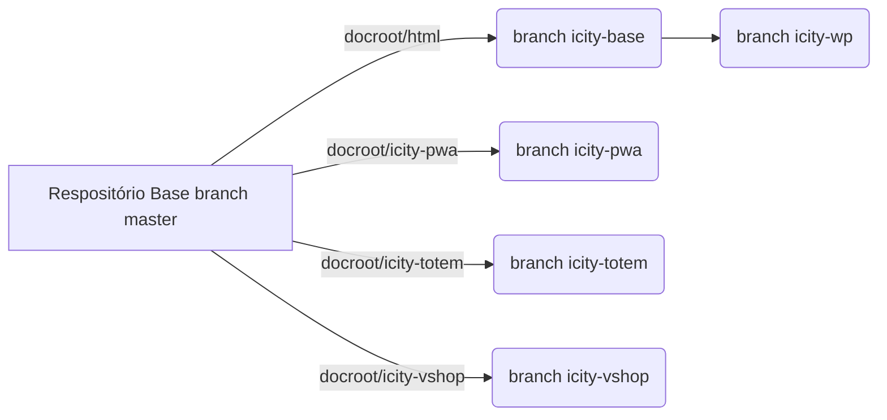

# Vocatio Telecom i-City - Cidades Interativas

i-City é uma plataforma completa utilizada em Cidades Inteligentes (**Smart Cities**) com sites baseados no **CMS WordPress**, aplicações **PWA**, Assistentes Virtuais (bots), Inteligência Artificial, Realidade Aumentada, Cidades Interativas, etc.

## Soluções Web

Nossa equipe de desenvolvedores especialista em soluções web para sua empresa. Criamos **aplicações responsivas** e **customizadas** para utilização tanto em destops, tablets ou dispositivos móveis, sem a necessidade de construir aplicativos nativos para cada plataforma. Este nova tecnologia chamada **PWA** (Progressive Web Application ou Aplicação Web Progressiva), rodam nos dispositivos totalmente off line, e quando detecta a conexão ele descarrega as informações no sistema do cliente ou atualiza a aplicação se necessário. Desenvolvimento rápido aliado à micro serviços dão o tom destas soluções.

A Primeira aplicação que desenvolvemos deste tipo, foi para os totens espalhados por vários pontos do país, no qual, as publicidades veiculadas nestes equipamentos, sofrem inúmeras atualizações e nem sempre a internet no local da instalação contribui para estes eventos. A primeira premissa da solução encontrada era de fazer um cache local de todas as publicidades veiculadas (imagens ou vídeos) de forma que o equipamento nunca permaneça inativo. Quando o contratante do totem atualiza a publicidade, nossa aplicação dispara uma notificação para a PWApp que logo conecta-se a um dos nossos servidores na nuvem recebendo a notificação, dependendo da conexão com a Internet, ele busca as atualizações e aplica imediatamente no PWApp.

### Progressive Web App

----

<<<<<<< HEAD
Na nova aplicação da plataforma Cidades interativas, implementamos novas tecnologias de **Assistentes Virtuais por Voz ou Texto**, **Reconhecimento de Imagens**, **Geo Localização e Rotas**, **Informação Local**, **Notificações** e **Publicidade**. É uma aplicação revolucionária em se tratando do uso da **Inteligência Artificial** e Ciência de Dados para gerar experiências únicas aos usuários.
=======
Na nova aplicação da plataforma Cidades interativas, implementamos as tecnologias de **Assistentes Virtuais por Voz ou Texto**, **Reconhecimento de Imagens**, **Geo Localização e Rotas**, **Informação Local**, **Notificações** e **Publicidade**. É uma aplicação revolucionária em se tratando do uso da **Inteligência Artificial** e Ciência de Dados para gerar experiências únicas aos usuários.
>>>>>>> icity-totem

Nossos Aplicativos **PWA** também atendem a outros segmentos como **IoT**, **Casas, Prédios e Condomínios Inteligentes**, **Internet Veicular**, **Controle de Acesso**, **Notificações in Real Time**, **Internet Rural**, etc. Estes aplicativos dão muito mais inteligência a qualquer controle digital, e o melhor de tudo, pode rodar no desktop, tablet ou celular. Tudo que você precisa controlar estará sempre ao alcance de suas mãos. A inovação por trás desta tecnologia é que a aplicação é criada em tempo record, utilizando **Rest API**, criamos **Micro Serviços** em nossos servidores que se comunicam com os sensores e transmitem os resultados para a aplicação cliente. Podemos assim, nos concentrar em oferecer interfaces que só o poder da WEB pode entregar aos usuários, conforme o exemplo da imagem abaixo.

Todos estes recursos podem ser agregados em um ambiente **3D** com a ajuda da **Realidade Aumentada**, que traz um novo mundo às aplicações WEB e serão o novo padrão de desenvolvimento em poucos anos. Assim como o **PWA** no passado, a Realidade Aumentada sofre uma grande restrição para sua implementação nos Navegadores da Internet, mas, iniciativas como a **WebGL (Web Graphics Library)** que é uma API em JavaScript, disponível a partir do novo elemento canvas da HTML5, oferece suporte para renderização de gráficos 2D e gráficos 3D. Pode ser implementado em uma aplicação web sem a necessidade de plug-ins no Navegador. A especificação foi lançada, sob versão 1.0, em 10 de fevereiro de 2011. WebGL é administrado pelo Khronos Group (fonte wikipédia WebGL).

As novas tecnologias para as Aplicações Web estão revolucionando o mercado de Web Design, e a Vocatio Telecom, sempre na vanguarda da tecnologia, acompanha e aplica todas as evoluções destas inovações para melhorar cada vez mais a experiência dos nossos clientes e usuários.

## Disposição dos Arquivos - Repositório vktio-icity

Os arquivos deste repositório foram divididos em branches e outros repositórios que functionam independente, os branches disponíves são:

- **icity-base:** Este branch contém arquivos base e os arquivos de posting do repositório, assim como o um arquivo post-receive para a criação de um repositório rebase.
- **icity-wp:** Branch que se refere ao site principal da aplicação baseado no **CMS WordPress**.
- **icity-pwa:** Applicação PWA básica da Plataforma. Nesta base já estão instalação automática no dispositivo do usuário, menus, service workers, push notifications e geo localização.
- **icity-totem:** Uma aplicação pwa voltadas para totens estáticos sem interações mas que mostram publicidades conforme o cliente configura no site de administração do seu totem.
- **icity-vshop:** Neste caso, a aplicação já possui interatividade com os clientes através de touch screen, **Realidade Aumentada** para **Passeios Virtuais 3D**, Loja de Produtos e Compras on-line. A tela de touch screen pode ser uma projeção em uma película reversa, o que configura realmente uma vitrine virtual, ou um painel LED ligado pela interface HDMI do dispositivo que irá rodar a app (**mini-pc**).

## Diagrama do Respositório

